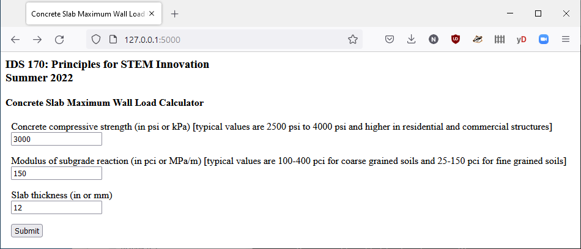
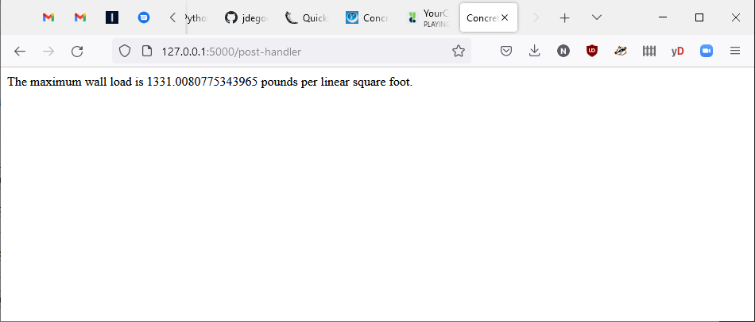

# flask-slab

## Overview

This is a simple Flask example for Summer 2022 IDS 170

## One-Time Installation

To perform the one-time installation, run the following in a Windows CMD shell:

```
# create an environment and activate it
cd myproject
python -m venv venv
venv\Scripts\activate

# install flask in the environment
pip install flask
```

## Usage

To use the Flask application, run the following in a Windows CMD shell:

```
# activate the previously-created environment
cd myproject
venv\Scripts\activate

# start the Flask application
set FLASK_APP=app.py 
flask run
# then browse to http://127.0.0.1:5000/
```

## Screenshots
  
  

## References

Flask documentation:  
https://flask.palletsprojects.com/

This example is derived from:  
https://scoutapm.com/blog/python-flask-tutorial-getting-started-with-flask  
https://www.easycalculation.com/engineering/civil/concrete-slab-maximum-wall-load.php  